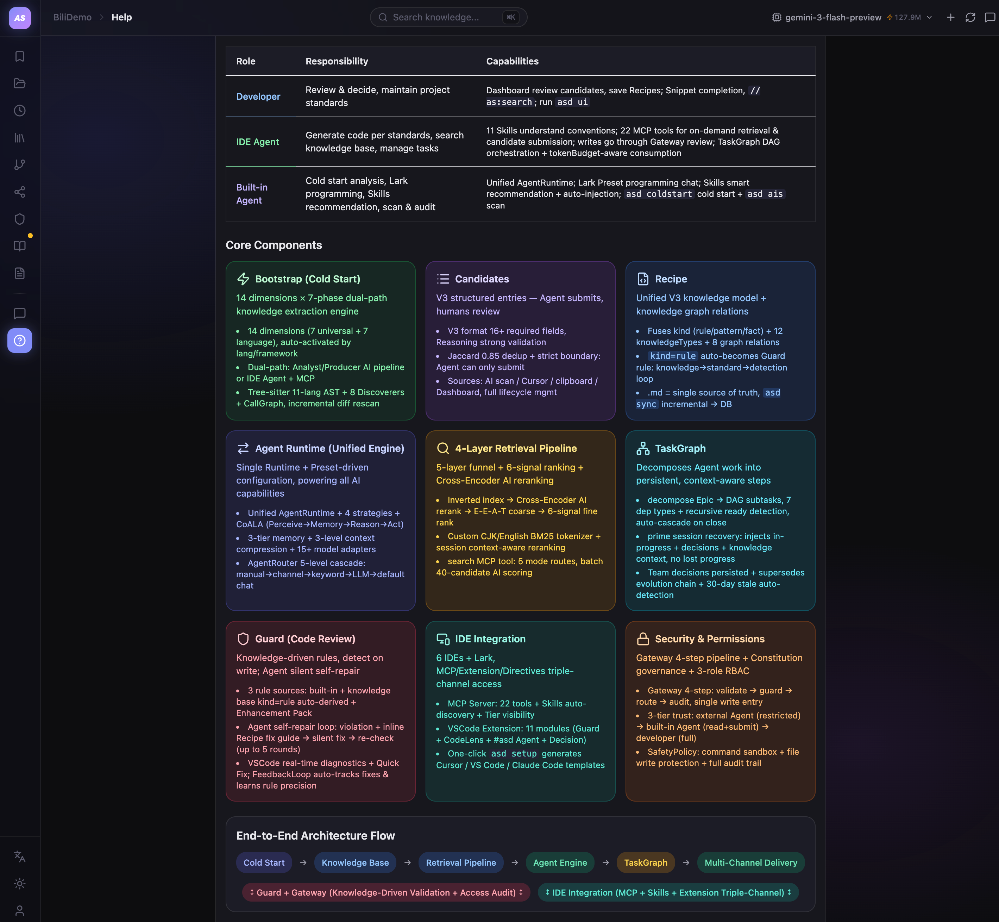

<div align="center">

# AutoSnippet

Extract code patterns from your codebase into a knowledge base, and serve them to AI coding assistants in your IDE — so generated code actually follows your team's conventions.

[](https://www.npmjs.com/package/autosnippet)
[](https://github.com/GxFn/AutoSnippet/blob/main/LICENSE)
[](https://nodejs.org)

[中文文档](README_CN.md)

</div>

---

## Why

Copilot and Cursor don't know how your team writes code. They'll generate something that works, but it won't look like yours — wrong naming, wrong patterns, wrong abstractions. You end up rewriting the AI's output or explaining the same conventions in every PR review.

AutoSnippet fixes this. It scans your codebase, extracts the patterns that matter (with your approval), and makes them available to any AI tool via [MCP](https://modelcontextprotocol.io/). Next time Cursor generates code, it actually follows your conventions.

```
Your code  →  AI extracts patterns  →  You review  →  Knowledge base
                                                            ↓
                                              Cursor / Copilot / VS Code / Xcode
                                                            ↓
                                                  AI follows your patterns
```

## Get Started

```bash
npm install -g autosnippet

cd your-project
asd setup        # workspace + DB + IDE configs (Cursor, VS Code, Trae, Qoder)
asd coldstart    # scans your code, generates pattern candidates
asd ui           # open the dashboard to review what was found
```

That's it. After you approve some candidates, they become **Recipes** — structured knowledge entries that your IDE's AI can query in real time.

## How It Works

```
asd setup → asd coldstart → Dashboard review → IDE AI consumes Recipes → write code → asd ais rescan → loop
```

1. **`asd setup`** — Creates workspace, SQLite DB, MCP configs, installs VS Code extension.
2. **`asd coldstart`** — Multi-angle codebase scan, produces **Candidates**.
3. **Review in Dashboard** — Approve, edit, or reject. Approved → Recipe.
4. **IDE picks them up** — Via MCP, Cursor Rules, Agent Skills, or TaskGraph task context.
5. **Keep going** — `asd ais <target>` for targeted scans, or describe what you want in Cursor.

## Dual Pipeline — Internal Agent & External Agent

Every core capability works through two fully independent pipelines. Pick whichever fits your setup — or use both:

| Capability | Internal Agent (built-in AI) | External Agent (IDE-driven) |
|---|---|---|
| **Cold Start** | Analyst/Producer dual-agent auto-scan | IDE agent reads Mission Briefing + MCP tools |
| **Knowledge Extraction** | `asd ais` → built-in AI pipeline | Cursor/Copilot calls `submit_with_check` |
| **Project Skills** | Auto-generated from analysis text | IDE agent calls `autosnippet_skill(create)` |
| **Repo Wiki** | Auto-generated at end of cold start | IDE agent calls wiki MCP tools |
| **Guard** | Built-in rule engine (no AI needed) | Same — shared infrastructure |
| **Search & Retrieval** | MCP server serves results | Same — shared infrastructure |
| **Requires** | AI provider API key | IDE with agent capabilities |

If no AI is available at all, a rule-based fallback still extracts basic knowledge from AST and Guard data.

> **LLM quality matters.** Higher-capability models (Claude Opus 4 / Sonnet 4, GPT-5, Gemini 3 Pro) produce significantly better results — more accurate patterns, richer architectural insights, fewer false positives.

## Dashboard

Run `asd ui` to manage everything in one place:

<div align="center">

</div>

## Features

| Feature | Description |
|---------|-------------|
| **Pattern Extraction** | AI reads code → identifies reusable patterns → structures as Recipe. 9 languages (Tree-sitter AST) |
| **Search** | BM25 keyword → semantic rerank → quality score → multi-signal ranking. Chinese & English |
| **Guard** | Regex + AST compliance rules. `asd guard:ci` for CI, `asd guard:staged` for pre-commit |
| **CallGraph** | Static call graph analysis across 8 languages. MCP `call_graph` + `call_context` |
| **TaskGraph** | DAG task orchestration + tokenBudget-aware + persistent team decisions |
| **AI Providers** | Gemini, OpenAI, Claude, DeepSeek, Ollama, with auto-fallback |

## IDE Support

| IDE | Integration | How it connects |
|-----|-------------|----------------|
| **VS Code** | Extension + MCP | `#asd` in Agent Mode; search, directives, CodeLens, Guard |
| **Cursor** | MCP + Rules | `.cursor/mcp.json` + `.cursor/rules/` |
| **Claude Code** | MCP + CLAUDE.md | `CLAUDE.md` + MCP tools; supports hooks |
| **Trae / Qoder** | MCP | Auto-generated by `asd setup` |
| **Xcode** | File watcher | `asd watch` + file directives + snippet sync |
| **Lark (Feishu)** | Bot + WebSocket | Send commands from phone → IDE executes via Copilot Agent Mode |

All configs generated by `asd setup`. Run `asd upgrade` to refresh after updates.

## File Directives

Write these in any source file:

```
// as:s network timeout       Search recipes and insert the match
// as:c                       Create a candidate from surrounding code
// as:a                       Run Guard audit on this file
```

The VS Code extension and `asd watch` (Xcode) pick these up automatically.

## CLI

| Command | What it does |
|---------|-------------|
| `asd setup` | Init workspace, DB, IDE configs |
| `asd coldstart` | Full codebase scan → candidates |
| `asd ais [target]` | Scan a specific module |
| `asd ui` | Dashboard + API server |
| `asd search <query>` | Search knowledge base |
| `asd guard <file>` | Run compliance check |
| `asd guard:ci` | CI mode with quality gate |
| `asd guard:staged` | Pre-commit hook |
| `asd watch` | Xcode file watcher |
| `asd sync` | Sync recipe markdown → DB |
| `asd task` | Task management (TaskGraph) |
| `asd upgrade` | Update IDE integrations |
| `asd status` | Health check |

## Project Structure

After `asd setup`, your project gets:

```
your-project/
├── AutoSnippet/           # Knowledge data (git-tracked)
│   ├── recipes/           # Approved patterns (Markdown)
│   ├── candidates/        # Pending review
│   └── skills/            # Project-specific agent instructions
├── .autosnippet/          # Runtime cache (gitignored)
│   ├── autosnippet.db     # SQLite
│   └── context/           # Vector index
├── .cursor/mcp.json       # Cursor MCP config
└── .vscode/mcp.json       # VS Code MCP config
```

Recipes are Markdown files. SQLite is a read cache. If the DB breaks, `asd sync` rebuilds it.

## Remote Programming via Lark

Code from your phone. Send messages in Lark (Feishu) → they get injected into VS Code Copilot Agent Mode → results sent back to Lark. Task notifications with IDE screenshots are pushed back automatically.

See [Lark Integration Guide](docs/lark-integration.en.md) for setup instructions.

## Configuration

Put a `.env` in your project root, or use Dashboard → LLM Config:

```env
# Pick one (multiple = auto-fallback)
ASD_GOOGLE_API_KEY=...
ASD_OPENAI_API_KEY=...
ASD_CLAUDE_API_KEY=...
ASD_DEEPSEEK_API_KEY=...

# Or run local
ASD_AI_PROVIDER=ollama
ASD_AI_MODEL=llama3
```

## Architecture

```
IDE Layer           Cursor · VS Code · Trae · Qoder · Xcode · Dashboard · Lark
                                        │
                               MCP Server (22 tools) + HTTP API
                                        │
Agent Layer         AgentRouter → Preset → AgentRuntime (ReAct loop)
                    ├── Strategy: Single / Pipeline / FanOut / Adaptive
                    ├── Capability: Conversation · CodeAnalysis · KnowledgeProduction · System
                    ├── Policy: Budget · Safety · QualityGate
                    └── Memory: ActiveContext → SessionStore → PersistentMemory
                                        │
Service Layer       Search · Knowledge · Guard · Chat · Bootstrap · Wiki · TaskGraph
                                        │
Core Layer          AST (9 lang) · CallGraph (8 lang) · KnowledgeGraph · RetrievalFunnel · QualityScorer
                                        │
Infrastructure      SQLite · VectorStore · EventBus · AuditLog · DI Container (40+) · ContextWindow
```

## Requirements

- Node.js ≥ 20
- macOS recommended (Xcode features need it; everything else is cross-platform)
- better-sqlite3 (bundled)

## Contributing

1. `npm test` before submitting
2. Follow existing patterns (ESM, domain-driven structure)

## License

[MIT](LICENSE) © gaoxuefeng
