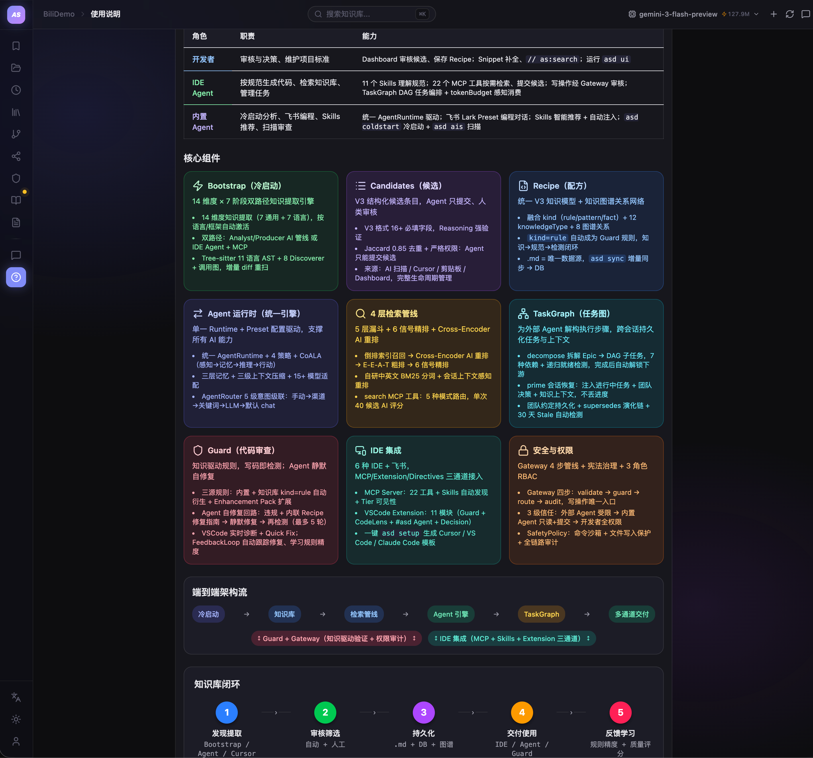

<div align="center">

# AutoSnippet

将代码库中的模式提取为知识库，供 IDE 中的 AI 编码助手查询——让生成的代码真正符合你们团队的规范。

[](https://www.npmjs.com/package/autosnippet)
[](https://github.com/GxFn/AutoSnippet/blob/main/LICENSE)
[](https://nodejs.org)

[English](README.md)

</div>

---

- [为什么需要它](#为什么需要它) · [开始使用](#开始使用) · [在 IDE 中使用](#在-ide-中使用) · [更多能力](#更多能力) · [Dashboard](#dashboard) · [IDE 支持](#ide-支持) · [架构](docs/architecture.md)

## 为什么需要它

Copilot 和 Cursor 不知道你们团队怎么写代码。它们生成的东西能跑，但不像你们写的——命名不对、模式不对、抽象层次不对。最后要么你重写 AI 的输出，要么在每次 Code Review 里反复解释同样的规范。

AutoSnippet 建立一层**本地化的项目记忆**。它扫描你的代码库，提取有价值的模式（需要你批准），然后通过 [MCP](https://modelcontextprotocol.io/) 让所有 AI 工具都能查到。这些知识持久化在本地，不会占用 LLM 的上下文窗口，而是在 AI 需要时按需注入——项目知识积累得越多，生成的代码越符合你们的规范。

```
你的代码  →  AI 提取模式  →  你来审核  →  知识库
                                           ↓
                             Cursor / Copilot / VS Code / Xcode
                                           ↓
                                   AI 按你的模式生成
```

## 开始使用

```bash
npm install -g autosnippet

cd your-project
asd setup     # 初始化工作空间 + 数据库 + MCP 配置（自动检测 Cursor / VS Code / Trae / Qoder）
asd ui        # 启动后台服务（MCP Server + Dashboard），IDE 和 MCP 工具依赖此服务运行
```

> **Trae / Qoder 用户：** `asd setup` 后运行 `asd mirror`，将 `.cursor/` 配置同步到 `.trae/` / `.qoder/`。

## 在 IDE 中使用

`asd setup` 配置好了一切。打开 IDE 的 **Agent Mode**（Cursor Composer / VS Code Copilot Chat / Trae），跟 Agent 对话就行。

> **首次使用：** 需在 IDE 的 MCP 设置中手动开启 `autosnippet` 服务。

> **提示：** IDE Agent 使用的模型越强，效果越好。推荐在 Cursor / Copilot 中选择 Claude Opus 4 / Sonnet 4、GPT-5 或 Gemini 3 Pro，产出更准确的模式和更少的误报。

### 冷启动：建立项目知识库

> 💬 *"帮我冷启动，生成项目知识库"*

Agent 扫描整个项目，提取出团队的编码模式、架构约定、调用习惯，同时生成项目 Wiki。冷启动只做一次，之后就进入日常使用。

### 日常：说一句话就行

| 你说 | 你得到 |
|------|--------|
| ① *"项目里 API 接口怎么写"* | 直接拿到符合你们项目风格的代码，而不是通用示例 |
| ② *"帮我写一个用户注册接口"* | 生成的代码自动遵循刚才查到的 API 规范 |
| ③ *"检查这个文件符不符合项目规范"* | 提交前过一遍规范检查，减少 Code Review 里的反复沟通 |
| ④ *"把这段错误处理保存为项目规范"* | 一次沉淀，以后所有人的 AI 都会学会这个写法 |

Agent 写完代码后，Guard 合规引擎会自动检查 diff——发现违规即自我修复，不需要你手动介入。

### 越用越好

候选在 Dashboard（`asd ui`）中审核并批准 → 变成 **Recipe** → AI 生成代码时自动参照 → 你发现新的好写法 → 继续沉淀 → AI 越来越像团队的人。这些知识是本地 Markdown 文件，跟 git 走，不会随对话消失，也不占上下文窗口——知识库再大也不会拖慢 AI。

## 更多能力

### Guard 合规引擎

除了 Agent 自动检查，Guard 也可以接入你的工程流程：

```bash
asd guard src/            # 检查目录
asd guard:staged          # pre-commit 只查暂存文件
asd guard:ci --threshold 90  # CI 质量门禁
```

内置多语言合规规则（正则 + AST），检查命名、废弃 API、线程安全等，每条违规附带修复示例。

### 调用图

重构前想知道改一个函数会影响哪些地方？8 种语言的静态调用图分析，通过 MCP 工具 `call_graph` 和 `call_context` 查询任意函数的调用者、被调用者和影响范围。

### 语义搜索

关键词搜索只能找字面匹配。配置 LLM API Key 后，搜索升级为向量 + BM25 混合检索——问"如何管理内存"能找到垃圾回收相关的 Recipe，语义相近的结果排在前面。

### 意图感知搜索（Prime）

Agent 每次对话开始时自动触发 prime，根据用户查询和当前文件智能注入知识。IntentExtractor 提取技术术语、推断语言和模块、进行中英文交叉同义词展开；PrimeSearchPipeline 执行多路并行搜索（原始查询 + 术语查询 + 文件上下文 + 聚焦同义词），经过三层质量过滤后返回精准结果。支持长句自然语言、短句精确匹配、混合语言查询。

### Recipe 源码证据（sourceRefs）

Recipe 携带创建时分析的项目文件路径作为证据。搜索结果中的 📍 sourceRefs 指向项目中的真实文件，Agent 无需自行验证即可信任并引用。后台自动监控路径有效性，git rename 自动修复。

### 知识图谱

Recipe 之间有关联关系。查询某个模块的影响路径、依赖深度、关联 Recipe，在积累了一定量的知识后，帮你看清知识之间的结构。

### 自循环信号机制

后台持续收集你的编码习惯信号（Guard 违规、对话主题、Recipe 使用率、候选积压、操作日志、git diff），AI 从中挖掘规律并推荐 Skill。不喜欢？随手删掉，没有任何负担。但如果某条推荐恰好说中了你们团队的习惯——这就是白捡的便宜。你的采纳或忽略会反馈回算法，推荐会越来越准。

### 飞书远程编程

手机上在飞书发一句话，意图识别自动分流到本地 IDE，由 Copilot Agent Mode 执行，结果回传飞书。重构、截屏、查规范——身边可以没有电脑，只要电脑没有进入睡眠就行。

### Recipe 远程仓库

`asd remote <url>` 将知识库目录转为独立 git 子仓库。多项目共享同一套 Recipe，独立控制读写权限，统一管理和版本追踪。

> 语义搜索、信号推荐、飞书远程等 AI 驱动功能需要 LLM API Key。在 Dashboard 的 LLM 配置中设置，或在 `.env` 中填写——支持 Google / OpenAI / Claude / DeepSeek / Ollama，多个自动 fallback。

## Dashboard

`asd ui` 启动 Dashboard，在一个界面管理所有功能：

<div align="center">

</div>

## IDE 支持

| IDE | 集成方式 | 接入说明 |
|-----|---------|----------|
| **VS Code** | 扩展 + MCP | Agent Mode 中 `#asd` 引用工具；搜索、指令、CodeLens、Guard |
| **Cursor** | MCP + Rules | `.cursor/mcp.json` + `.cursor/rules/` |
| **Claude Code** | MCP + CLAUDE.md | `CLAUDE.md` + MCP 工具；支持 hooks |
| **Trae / Qoder** | MCP | `asd setup` 自动生成 |
| **Xcode** | 文件监听 | `asd watch` + 文件指令 + Snippet 同步 |
| **飞书 (Lark)** | Bot + WebSocket | 手机发消息 → IDE 通过 Copilot Agent Mode 执行 |

所有配置由 `asd setup` 自动生成。更新后运行 `asd upgrade` 刷新。

## 项目结构

`asd setup` 之后，你的项目里会多出这些：

```
your-project/
├── AutoSnippet/           # 知识数据（git 跟踪）
│   ├── recipes/           # 已审核的模式（Markdown）
│   ├── candidates/        # 待审核
│   └── skills/            # 项目特定的 Agent 指令
├── .autosnippet/          # 运行时缓存（gitignored）
│   ├── autosnippet.db     # SQLite
│   └── context/           # 向量索引
├── .cursor/mcp.json       # Cursor MCP 配置
└── .vscode/mcp.json       # VS Code MCP 配置
```

Recipe 是 Markdown 文件。SQLite 只是读缓存。数据库坏了 `asd sync` 一下就行。

## 配置详情

更多 LLM 配置选项参见 [Configuration Guide](docs/configuration.md)。

## 架构

详见 [架构文档](docs/architecture.md)。

## 系统要求

- Node.js ≥ 22
- macOS 推荐（Xcode 功能需要；其他功能跨平台可用）
- better-sqlite3（已内置）

## 贡献

1. 提交前跑 `npm test`
2. 遵循现有代码模式（ESM、领域驱动结构）

## License

[MIT](LICENSE) © gaoxuefeng
